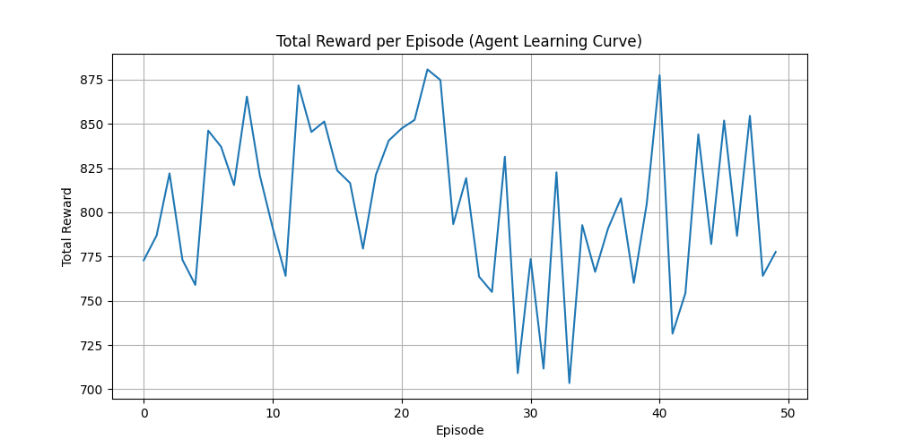
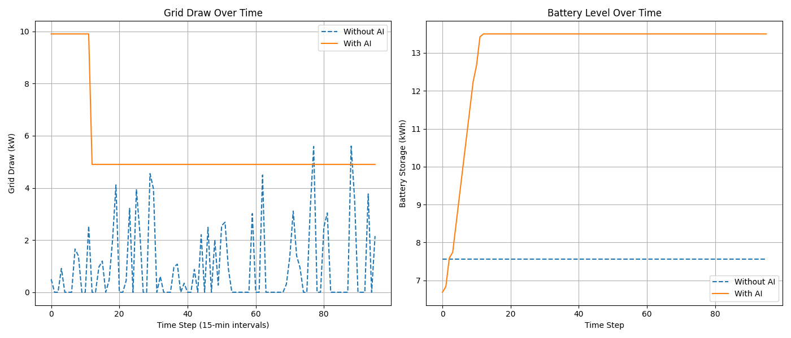

# ⚡️ Project Volta

> **AI-powered Virtual Power Plant for Smarter, Cleaner Energy Grids**

---


---

## 🌍 Overview

**Project Volta** was built during a Tesla-sponsored sustainability hackathon with one big goal:  
Make local energy grids smarter by teaching home batteries when to store and when to share.

Using **AI forecasting**, **reinforcement learning**, and real-time cloud architecture, this project simulates a microgrid that responds to energy demand like a pro — balancing sustainability and efficiency at the edge.

---

## 🚀 Key Features

- 🔮 **Forecasts Grid Demand:** Predicts next-hour usage with ML models (scikit-learn)
- ⚡ **RL-Controlled Battery Logic:** A DQN agent determines optimal charge/discharge timing
- 📊 **Live Analytics:** Time-series dashboards via Grafana + InfluxDB
- ☁️ **Cloud-Native:** Built on AWS IoT Core, Lambda, and CloudWatch for scalability

---

## 🧠 Tech Stack

| Category            | Tools/Tech                              |
|---------------------|------------------------------------------|
| Languages & AI      | Python, TensorFlow, scikit-learn         |
| Simulation Engine   | Custom Python logic, pandas, NumPy       |
| Infrastructure      | AWS IoT Core, Lambda, CloudWatch         |
| Data & Dashboards   | InfluxDB, Grafana, Docker                |

---

## 🖼️ Visuals

| AI-Driven Grid Simulation | RL Training Progress | Forecast Comparison |
|---------------------------|----------------------|----------------------|
|  |  |  |

---

## 📦 Getting Started

```bash
# Clone repo
git clone https://github.com/andre-rowe/Project-Volta.git
cd Project-Volta

# Install dependencies
pip install -r requirements.txt

# Run the simulation
python run_simulation.py

# (Optional) Start dashboard
docker-compose up
